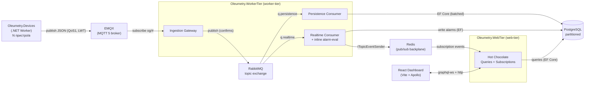

# Oleumetry — Бриф / Технічне завдання

> Навчальний демо-проект: телеметрія нафтогазового обладнання через MQTT → RabbitMQ → Postgres, з GraphQL API та React-дашбордом, який показує весь стек «під капотом».

- **Назва:** Oleumetry (лат. *oleum* «нафта» + *telemetry*)
- **Платформа:** .NET 10 (LTS), ASP.NET Core
- **ОС розробки:** Ubuntu, VS Code
- **Домен:** Oil & Gas (видобуток / підготовка)
- **Статус:** брифінг завершено, готові до Phase 0

---

## 1. Мета та межі

### Мета
Навчальний проект, що демонструє повний наскрізний потік промислової телеметрії:
**edge-обладнання → MQTT-брокер → .NET-інгест → RabbitMQ (fan-out) → Postgres + GraphQL subscriptions → React-дашборд.**
Головна цінність — **видно всю механіку**: статус MQTT, стан черги RabbitMQ, нутрощі GraphQL.

### Принципи (обов'язкові)
1. **Config-driven parity (12-factor).** Застосунок не знає, де фізично живуть Postgres / RabbitMQ / MQTT — адреси беруться з env / connection strings. Один код, дві конфігурації (локально ↔ хмара).
2. **Free-tier-ready з першого коміту**, але `git clone && docker compose up` працює локально без жодного акаунта в Azure.
3. **«Видно механіку» > «магія».** Свідомо обрані низькорівневі інструменти (сирий RabbitMQ.Client, Dapper), щоб демонструвати роботу, а не ховати її.

### Поза межами v1 (non-goals)
- Мутації GraphQL (керування з UI) — читання + realtime достатньо.
- Квитування алармів (acknowledge) — аларми лише для показу.
- Ретенція/агрегація даних — тільки обмеження темпу симулятора.
- Автентифікація/авторизація, мультитенантність.
- GitHub Actions / автодеплой — окремий пізніший етап.

---

## 2. Стек (підсумок рішень)

| Шар | Вибір | Примітка |
|---|---|---|
| Runtime | **.NET 10** (LTS) | ASP.NET Core |
| БД | **PostgreSQL**, звичайна таблиця + **нативні партиції** по часу | без розширень (parity) |
| Хмарний PG | **Neon** (serverless, є як Azure-сервіс) | локально — docker |
| Міграції | **EF Core migrations** (raw SQL для партицій) | DbUp більше не потрібен |
| Доступ до даних | **EF Core** (Npgsql), повний | HC-проєкції/фільтри/пагінація «з коробки» |
| MQTT-брокер | **EMQX** (MQTT 5, web-дашборд) | локально docker / EMQX Serverless free |
| MQTT-клієнт (.NET) | **MQTTnet** | стандарт де-факто |
| Черга | **RabbitMQ**, **topic exchange** | клієнт — офіційний **RabbitMQ.Client** |
| GraphQL-сервер | **Hot Chocolate** (ChilliCream) | Queries + Subscriptions, вбудована IDE **Nitro** |
| Subscriptions | **graphql-ws** (WebSocket) + **Redis backplane** | `HotChocolate.Subscriptions.Redis` |
| Backplane | **Redis** (pub/sub) | локально docker; хмара — Redis Cloud free / Upstash |
| Фронтенд | **Vite + React + TypeScript** | деплой на Azure Static Web Apps |
| GraphQL-клієнт | **Apollo Client** | WS-підписки + link-логер |
| UI-kit | **react-bootstrap + react-icons** | |
| Графіки | **Recharts** | |
| Локальна інфра | **docker-compose** | EMQX + RabbitMQ + Postgres + Redis |
| Топологія | **3 деплой-юніти**: WebTier / WorkerTier / Devices | Redis розв'язує web-tier і worker-tier |
| CI/CD | **поки нема** (Phase 4) | design лишається free-tier-ready |

---

## 3. Архітектура



**Розмежування транспортів (ключова ідея):**
- **MQTT** = транспорт з поля (device → cloud; багато пристроїв, ненадійна мережа).
- **RabbitMQ** = внутрішній бекбон обробки (fan-out на незалежних споживачів, надійність).

---

## 4. Домен і дані

### 4.1 Модель (мінімальна)
`Asset → Device → Reading → Alarm`. Різнотипне обладнання — через `Device.type` + узагальнена метрика (`metric + value + unit`), без окремих таблиць на тип.

### 4.2 Типи обладнання та метрики (mixed)
| Тип (`device.type`) | Метрики |
|---|---|
| `ESP_PUMP` | intake_pressure (bar), motor_temp (°C), vibration (mm/s), rpm, flow_rate (m³/d), current (A) |
| `WELLHEAD` | tubing_pressure (bar), casing_pressure (bar), temperature (°C), choke_position (%) |
| `SEPARATOR` | pressure (bar), level (%), gas_flow (m³/h), oil_flow (m³/h) |
| `COMPRESSOR` | suction_pressure (bar), discharge_pressure (bar), temperature (°C), rpm, vibration (mm/s) |

### 4.3 Схема БД (ескіз)
> Створюється **міграціями EF Core**; партиційований `readings` — через `migrationBuilder.Sql(...)` (EF не виражає `PARTITION BY` декларативно). `assets/devices/alarms` — звичайні EF-сутності.

```sql
CREATE TABLE assets (
  id         bigint GENERATED ALWAYS AS IDENTITY PRIMARY KEY,
  name       text NOT NULL,
  field      text NOT NULL,
  well       text NOT NULL,
  location   text,
  created_at timestamptz NOT NULL DEFAULT now()
);

CREATE TABLE devices (
  id         text PRIMARY KEY,             -- напр. 'esp-001'
  asset_id   bigint NOT NULL REFERENCES assets(id),
  type       text NOT NULL,                -- ESP_PUMP | WELLHEAD | SEPARATOR | COMPRESSOR
  name       text NOT NULL,
  serial     text,
  created_at timestamptz NOT NULL DEFAULT now()
);

-- партиційована по часу; PK мусить містити ключ партиції (ts)
CREATE TABLE readings (
  device_id text NOT NULL,
  metric    text NOT NULL,
  value     double precision NOT NULL,
  unit      text NOT NULL,
  ts        timestamptz NOT NULL,
  PRIMARY KEY (device_id, metric, ts)
) PARTITION BY RANGE (ts);

CREATE TABLE readings_2026_09_19 PARTITION OF readings
  FOR VALUES FROM ('2026-09-19') TO ('2026-09-20');
CREATE INDEX ON readings (device_id, ts DESC);

CREATE TABLE alarms (
  id        bigint GENERATED ALWAYS AS IDENTITY PRIMARY KEY,
  device_id text NOT NULL,
  metric    text NOT NULL,
  value     double precision NOT NULL,
  threshold double precision NOT NULL,
  severity  text NOT NULL,                 -- warning | critical
  ts        timestamptz NOT NULL DEFAULT now(),
  status    text NOT NULL DEFAULT 'active' -- v1: без ack
);
```

### 4.4 Партиції та ретенція
- Партиції — **по добі** (`RANGE(ts)`). Фоновий job у **WorkerTier** (`PartitionMaintenance`) попередньо створює партиції на майбутнє.
- **Ретенції немає** — контролюємо об'єм через обмеження темпу симулятора. За потреби ретенція додається одним `DROP TABLE readings_<date>`.

### 4.5 Пороги алармів
- v1: пороги задаються в `appsettings` (per deviceType + metric).
- Realtime-споживач оцінює значення **inline**; при виході за поріг пише в `alarms` і емітить подію в UI.

### 4.6 Доступ до даних (EF Core)
- **Читання/GraphQL:** EF Core `IQueryable` + Hot Chocolate `[UseProjection]/[UseFiltering]/[UseSorting]/[UsePaging]` — мінімум коду.
- **Запис телеметрії:** повний EF Core (за рішенням), але **батчами** (`AddRange` + один `SaveChanges` на пачку), щоб зменшити round-trips.
- **Скейл-нота:** для демки (обмежений темп) change-tracking не заважає; якщо потік виросте — гарячий insert легко замінити на bulk (`EFCore.BulkExtensions`/Npgsql `COPY`) без зміни read-моделі.
- **Міграції:** EF Core, застосовуються **одним власником — `Oleumetry.WebTier` на старті** (`Migrate()`); WorkerTier толерує «схема ще не готова» через ретрай.
- **DbContext** живе в `Oleumetry.Postgres` і використовується і в WebTier (читання), і в WorkerTier (запис).

---

## 5. MQTT

- **Брокер:** EMQX (локально docker: `1883` MQTT, `8083` WS, `18083` dashboard).
- **Клієнт .NET:** MQTTnet.

### 5.1 Топіки
```
og/{field}/{well}/{deviceType}/{deviceId}/telemetry   ← дані
og/{field}/{well}/{deviceType}/{deviceId}/status      ← online/offline (retained + LWT)
```
Інгест підписується на `og/#`.

### 5.2 Payload телеметрії (JSON)
```json
{
  "deviceId": "esp-001",
  "deviceType": "ESP_PUMP",
  "field": "north",
  "well": "w-12",
  "ts": "2026-09-19T10:15:00Z",
  "metrics": [
    { "name": "intake_pressure", "value": 82.4, "unit": "bar" },
    { "name": "motor_temp",      "value": 96.1, "unit": "C" },
    { "name": "vibration",       "value": 3.2,  "unit": "mm/s" }
  ]
}
```
Payload статусу (retained + LWT): `{ "deviceId": "esp-001", "status": "online|offline", "ts": "..." }`

### 5.3 Реалістичні фічі (усі увімкнені)
- **QoS 1** (at-least-once) для телеметрії.
- **LWT** → брокер сам публікує `status=offline` при обриві → живить віджет «MQTT-статус».
- **Retained** last-value на `status` (і, за бажанням, на останню телеметрію) → новий підписник одразу бачить стан.
- **MQTT 5 user properties**: `schemaVersion`, `contentType=application/json`, `messageId`.

### 5.4 Симулятор (`Oleumetry.Devices`)
- Окремий **.NET Worker** (`BackgroundService`), імітує N пристроїв різних типів.
- Конфіг: кількість пристроїв, інтервал публікації (темп), сценарії дрейфу/сплесків для алармів.
- Керується через `appsettings`/env (не через GraphQL у v1).

---

## 6. RabbitMQ

- **Клієнт:** офіційний `RabbitMQ.Client` (низькорівнево, видно все).
- Локально: `5672` (amqp), `15672` (management UI).

### 6.1 Топологія
- **Exchange:** `oleumetry.telemetry` (тип **topic**, durable).
- **Routing key:** `telemetry.{deviceType}` (напр. `telemetry.ESP_PUMP`).
- **Queues:**
  - `q.persistence` — binding `telemetry.#` → Persistence Consumer
  - `q.realtime`    — binding `telemetry.#` → Realtime Consumer (+ inline alarm-eval)
- **Dead-lettering:** DLX `oleumetry.dlx` → `q.dlq` (через `x-dead-letter-exchange` на робочих чергах).

### 6.2 Ролі (fan-out)
1. **Розв'язка + буфер** — ingest-темп ≠ швидкість запису в БД; сплески гасяться чергою.
2. **Fan-out** — одне повідомлення паралельно йде на запис і на трансляцію в UI; споживачі незалежні.
3. **Надійність** — погане повідомлення не втрачається й не блокує чергу (DLQ).

### 6.3 Надійність (увімкнено)
- **Publisher confirms** на боці інгесту.
- **Manual ack** на споживачах; при помилці → nack без requeue → **DLQ**.
- Помірний **prefetch** (напр. 50) для балансу навантаження.

---

## 7. GraphQL API

- **Сервер:** Hot Chocolate. IDE **Nitro** на `/graphql`.
- **Доступ до даних:** EF Core (Npgsql) — HC-проєкції/фільтри/пагінація над `IQueryable` «з коробки»; EF ще й логує згенерований SQL (наочно для навчання).
- **Тільки Queries + Subscriptions** (мутацій нема).

### 7.1 Queries (ескіз)
```graphql
type Query {
  assets: [Asset!]!
  devices(assetId: ID, type: DeviceType): [Device!]!
  latestReadings(deviceId: ID!): [Reading!]!
  readings(deviceId: ID!, metric: String, from: DateTime, to: DateTime,
           first: Int, after: String): ReadingConnection!   # cursor-пагінація (HC UsePaging)
  alarms(status: String, deviceId: ID, from: DateTime, to: DateTime): [Alarm!]!
  infra: InfraStatus!   # дані з RabbitMQ Management API + EMQX API
}
```

### 7.2 Subscriptions
```graphql
type Subscription {
  onReading(deviceId: ID): Reading!
  onAlarm: Alarm!
  onDeviceStatus: DeviceStatus!
}
```
- Транспорт **graphql-ws** (WebSocket).
- Підкладка **Redis backplane** (`HotChocolate.Subscriptions.Redis`).
- Потік: Realtime-споживач (у **WorkerTier**) шле подію через `ITopicEventSender` → Redis pub/sub → **WebTier** доставляє підписникам. Обидва процеси конфігурують той самий Redis-провайдер (WorkerTier — sender, WebTier — receiver).
- ✅ **Наслідок:** web-tier (WebTier) і worker-tier (WorkerTier) розв'язані; WebTier масштабується на N інстансів. Топологія — вільний вибір, а не примус.

### 7.3 Інфраструктурний статус
`infra` збирається бекендом (браузер не ходить в інфру напряму):
- **RabbitMQ**: глибина черг, DLQ, publish/ack rate — через RabbitMQ **Management HTTP API**.
- **MQTT**: підключені клієнти/сесії — через **EMQX API**.

---

## 8. Frontend (React)

- **Стек:** Vite + React + TypeScript. Деплой — **Azure Static Web Apps**.
- **GraphQL-клієнт:** Apollo Client (`HttpLink` + `GraphQLWsLink`, split за типом операції).
- **UI:** react-bootstrap + react-icons. **Графіки:** Recharts.

### 8.1 Дашборд — панелі «під капотом»
| Віджет | Джерело даних |
|---|---|
| **Живі графіки телеметрії** | GraphQL subscription `onReading` (Recharts) |
| **MQTT-статус пристроїв** | GraphQL subscription `onDeviceStatus` (LWT/retained) |
| **Черга RabbitMQ** (глибина, DLQ, rate) | polled query `infra.rabbit` |
| **GraphQL-інспектор дроту** | кастомний Apollo-link, що логує операції та WS-кадри з таймінгами |
| Список алармів (read-only) | subscription `onAlarm` + query `alarms` |
| Огляд поля (пристрої + статуси) | query `devices` + статус-підписки |

---

## 9. Структура рішення (пропозиція)

```
oleumetry/
├─ Oleumetry.slnx
├─ src/
│  ├─ Oleumetry.Model/         # прості POCO-сутності:
│  │                            #   Asset, Device, Reading, Alarm, MetricThreshold + enums
│  │                            #   залежностей — НУЛЬ
│  ├─ Oleumetry.UseCases/     # тонкий шар сервісів (оцінка порогів, оркестрація)
│  │                            #   → Model
│  ├─ Oleumetry.Postgres/ # адаптер PostgreSQL: DbContext, репозиторії, міграції
│  │                            #   → UseCases (+ Model транзитивно)
│  ├─ Oleumetry.RabbitMq/ # адаптер RabbitMQ: publisher/consumers/DLQ + Mgmt API → UseCases, Contracts
│  ├─ Oleumetry.Emqx/ # адаптер EMQX: MQTTnet-інгест + status API → UseCases, Contracts
│  ├─ Oleumetry.Redis/ # адаптер Redis: backplane підписок → UseCases, Contracts
│  ├─ Oleumetry.Contracts/      # чисті wire-DTO (MQTT payload, інтеграційні події)
│  │                            #   shared kernel, залежностей — НУЛЬ
│  ├─ Oleumetry.WebTier/            # host (web-tier): Hot Chocolate
│  │                            #   застосовує EF-міграції на старті. → UseCases, Postgres, RabbitMq, Redis
│  ├─ Oleumetry.WorkerTier/      # host (worker-tier): BackgroundServices
│  │                            #   Ingestion / Persistence / Realtime / PartitionMaintenance
│  │                            #   → UseCases, Postgres, RabbitMq, Emqx, Redis, Contracts
│  └─ Oleumetry.Devices/      # host: .NET Worker → MQTT. → ТІЛЬКИ Contracts
├─ web/                         # Vite + React + TS (Apollo, react-bootstrap)
├─ deploy/
│  └─ docker-compose.yml        # emqx + rabbitmq + postgres + redis
└─ BRIEF.md
```

### 9.1 Правило залежностей (Clean Architecture)
```
Model ◄── UseCases ◄── Adapters { Postgres · RabbitMq · Emqx · Redis } ◄── Hosts (WebTier / WorkerTier / Devices)
Contracts ── shared kernel, ні від кого не залежить; використовують адаптери і Devices
```
- Стрілки дивляться **всередину, до Model**; Model — прості POCO, не знає про EF/MQTT/Rabbit.
- **Без DDD:** логіка (оцінка порогів алармів) — у простому сервісі в UseCases, а не на сутностях.
- `Reading` — append-only факт; `MetricThreshold` — реф-дані порогів у БД.
- 3 хости = 3 деплой-юніти; 7 бібліотек їх обслуговують (Model, UseCases, Contracts + 4 адаптери за системою).
```

---

## 10. Локальна розробка

`docker compose up` піднімає інфру:

| Сервіс | Порти |
|---|---|
| EMQX | 1883 (MQTT), 8083 (WS), 18083 (dashboard) |
| RabbitMQ | 5672 (amqp), 15672 (management UI) |
| PostgreSQL | 5432 |
| Redis | 6379 |

Далі: `dotnet run` для `Oleumetry.WebTier`, `Oleumetry.WorkerTier` та `Oleumetry.Devices`, `npm run dev` для `web/` (Vite на `5173`).
EF Core migrations застосовуються при старті WebTier (створює таблиці + початкові партиції); WorkerTier чекає готовності схеми.

---

## 11. Деплой (Phase 4, задокументовано — ще не будуємо)

Завдяки parity той самий код їде в хмару зі зміненими env:

| Компонент | Free-tier ціль |
|---|---|
| React (статика) | Azure **Static Web Apps** |
| WebTier / WorkerTier / Devices | Azure **Container Apps** (3 застосунки, безкоштовний грант) |
| PostgreSQL | **Neon** (serverless, Azure-native) |
| RabbitMQ | **CloudAMQP** «Little Lemur» |
| MQTT | **EMQX Serverless** / HiveMQ Cloud |
| Redis (backplane) | **Redis Cloud free** (30 МБ) / Upstash — не Azure Cache (нема free) |

> Нота по free-grant: WorkerTier і Devices майже завжди активні, тож не «сплять до нуля». За мінімальних ресурсів грант Container Apps це витримує; Devices можна вмикати на вимогу, щоб економити квоту.

GitHub Actions — **поки не робимо**; додамо окремим етапом (build/test → docker images → deploy).

---

## 12. Дорожня карта (фази)

- **Phase 0 — Каркас:** solution (10 проектів: Model/UseCases/Contracts + Postgres/RabbitMq/Emqx/Redis + WebTier/WorkerTier/Devices), `docker-compose` (EMQX+RabbitMQ+Postgres+Redis), EF Core DbContext у Oleumetry.Postgres + перша міграція з партиціями.
- **Phase 1 — Backend-труба:** Devices → MQTT → WorkerTier(Ingestion) → RabbitMQ → WorkerTier(Persistence) → Postgres (EF).
- **Phase 2 — GraphQL + realtime:** Hot Chocolate (queries + subscriptions/Redis), Realtime-споживач + inline-аларми → Redis → WebTier.
- **Phase 3 — Дашборд:** React з усіма 4 віджетами.
- **Phase 4 — Хмара (пізніше):** Azure free-tier (3 Container Apps + SWA + Neon + CloudAMQP + EMQX Serverless + Redis Cloud) + GitHub Actions.

---

## 13. Журнал рішень (decisions log)

| # | Рішення | Вибір |
|---|---|---|
| 1 | Доменна модель | Мінімальна (Asset→Device→Reading→Alarm) |
| 2 | Зберігання телеметрії | Таблиця + нативні партиції по часу |
| 3 | Хмарний Postgres | Neon (Azure-native) |
| 4 | Ретенція | Нема, лише ліміт темпу |
| 5 | Обладнання | Кілька типів (mixed) |
| 6 | MQTT-брокер | EMQX |
| 7 | Payload | JSON |
| 8 | «Обладнання» | Окремий .NET Worker (Devices) |
| 9 | MQTT-фічі | LWT + QoS 1 + retained + MQTT5 |
| 10 | RabbitMQ exchange | Topic |
| 11 | Споживачі | Persistence + Realtime (аларми inline) |
| 12 | Надійність | Manual ack + DLQ + publisher confirms |
| 13 | RabbitMQ-клієнт | RabbitMQ.Client (офіційний) |
| 14 | GraphQL-сервер | Hot Chocolate |
| 15 | GraphQL-операції | Queries + Subscriptions (без мутацій) |
| 16 | Subscriptions | graphql-ws + **Redis backplane** |
| 17 | Доступ до даних | **EF Core (повний)** |
| 18 | Frontend | Vite + React + TypeScript |
| 19 | GraphQL-клієнт | Apollo Client |
| 20 | UI-kit | react-bootstrap + react-icons |
| 21 | Дашборд-віджети | Телеметрія + MQTT-статус + RabbitMQ + GraphQL-інспектор |
| 22 | Міграції | **EF Core migrations** |
| 23 | Топологія | **3 юніти (WebTier / WorkerTier / Devices)** |
| 24 | CI/CD | Поки без Actions |
| 25 | Назва | **Oleumetry** |
| 26 | Backplane | **Redis** (Redis Cloud free / Upstash; не Azure Cache) |
| 27 | Архітектура | Шарувата (без DDD): Model/UseCases/Contracts + адаптери за системою (Postgres/RabbitMq/Emqx/Redis) |
| 28 | Розбивка адаптерів | Повна, за зовнішньою системою: кожен проект володіє всім спілкуванням зі своєю системою (дані + status/mgmt API) |
| 29 | Без DDD (наївна модель) | Прості POCO у Oleumetry.Model; логіка в сервісах UseCases. Домен тонкий — DDD був церемонією |
